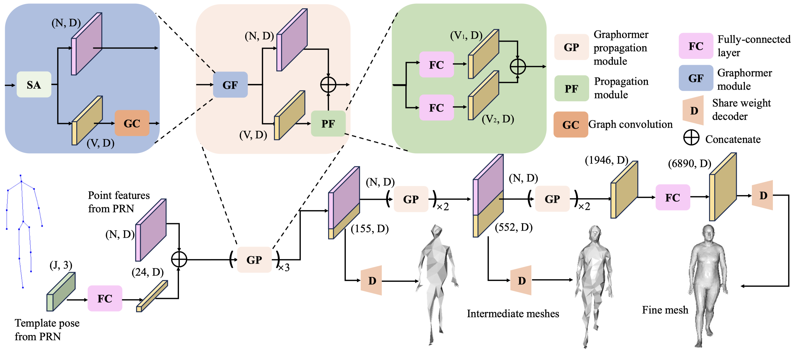
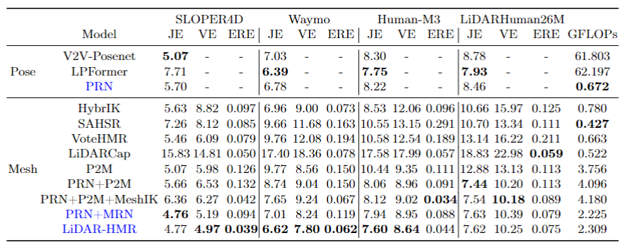

# LiDAR-HMR: 3D Human Mesh Recovery from LiDAR

### [Paper](https://arxiv.org/pdf/2311.11971) 

> LiDAR-HMR: 3D Human Mesh Recovery from LiDAR

> [Bohao Fan](https://github.com/soullessrobot)*, [Wenzhao Zheng](https://wzzheng.net/), [Jianjiang Feng](http://ivg.au.tsinghua.edu.cn/~jfeng/), [Jie Zhou](https://scholar.google.com/citations?user=6a79aPwAAAAJ&hl=en&authuser=1)

## Demo


## Introduction

In recent years, point cloud perception tasks have been garnering increasing attention. This paper presents the first attempt to estimate 3D human body mesh from sparse LiDAR point clouds. We found that the major challenge in estimating human pose and mesh from point clouds lies in the sparsity, noise, and incompletion of LiDAR point clouds. Facing these challenges, we propose an effective sparse-to-dense reconstruction scheme to reconstruct 3D human mesh. This involves estimating a sparse representation of a human (3D human pose) and gradually reconstructing the body mesh. To better leverage the 3D structural information of point clouds, we employ a cascaded graph transformer (graphormer) to introduce point cloud features during sparse-to-dense reconstruction. Experimental results on three publicly available databases demonstrate the effectiveness of the proposed approach.

### Challenges & Our pipeline


### Framework



### Results



### More Visualizations


## Code

Coming soon!

## Related Projects

Our code is based on [Human-M3-Dataset](https://github.com/soullessrobot/Human-M3-Dataset).

## Citation

If you find this project helpful, please consider citing the following paper:
```
@article{fan2023lidar,
    title={LiDAR-HMR: 3D Human Mesh Recovery from LiDAR},
    author={Fan, Bohao and Zheng, Wenzhao and Feng, Jianjiang and Zhou, Jie},
    journal={arXiv preprint arXiv:2311.11971},
    year={2023}
}
```
